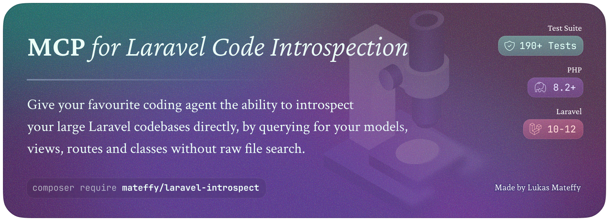

[//]: # (![Packagist Downloads]&#40;https://img.shields.io/packagist/dt/mateffy/laravel-introspect&#41;)

# MCP Server for Laravel Codebase Intelligence and Introspection

For AIs to make sense of your codebase, they need to be able to know what's in it.
While vector search is a powerful tool for searching through code, it uses a lot of tokens and doesn't even give you the full picture of your codebase for things like views or routes.
This package implements a [Model Context Protocol](https://modelcontextprotocol.io) (MCP) server for the [mateffy/laravel-introspect](https://github.com/capevace/laravel-introspect) package, which allows you to introspect your codebase and get structured information about it.

- 🔍 Let AI query views, routes, classes and models without needing to read through all of the code
- 🔍 Can even use wildcards (`*`) to match multiple views, routes, classes and models
- 🔍 Supports querying for things from Laravel packages, which most file searchers can't do
- 🪄 Gives your AI quick overviews of your datamodel and its relationships
- 🤖 Supports any AI agent implementing the [MCP protocol](https://modelcontextprotocol.io)

<br />

| Query      | Available Filters                                                      |
|------------|------------------------------------------------------------------------|
| Views      | name, path, used by view, uses view, extends                           |
| Routes     | name, URI, controller + fn, methods, middleware                        |
| Classes    | name / namespace, extends parent, implements interfaces, uses traits   |
| ⤷ Models   | ... relationships, properties, casts, fillable, hidden, read/writeable |
| ⤷ Commands | ... signature, description (_coming soon_)                             |

> Name and a few other queries even support wildcard queries (e.g. `components.*.paragraph`)

<br />

### Who is this for?

If you use AI tools like Aider, Cursor, Windsurf or Claude Code to help you build your app, this package is for you.
Simply configure the MCP server in your agent and it can automatically query your codebase for views, routes, classes and models.

This is especially useful for large codebases where just searching through the code is less practical.

#### Example tasks

- Give your AI an overview of your datamodel and its relationships
- Refactoring views and making sure it's not used anywhere else
- Finding all routes that use a specific controller
- Finding models that use a specific trait or interface
- Making sure all routes are using the correct middleware

### `laravel-codebase-mcp` vs. `laravel-introspect`

The MCP server uses the `laravel-introspect` package to introspect your codebase and get structured information about it.
If you want to write tests or run the same queries multiple times, you can also just [use the package directly](https://github.com/capevace/laravel-introspect).

<br />

## Installation

Install the package via composer:

```bash  
composer require mateffy/laravel-codebase-mcp --dev
```  

And then add it to your AI agent's MCP configuration:

```json
{
  "mcpServers": {
    "laravel-introspect": {
      "command": "php",
      "args": [
        "/path/to/your/codebase/artisan",
        "introspect:mcp"
      ]
    }
  }
}
```

> [!NOTE]  
> The MCP server is still in beta, there will probably be bugs!

<br />

## Available queries

If you want to see all available queries, please check the [`laravel-introspect` package documentation](https://github.com/capevace/laravel-introspect).

<br />

## Acknowledgements

The MCP server uses the [php-mcp/server](https://github.com/php-mcp/server) package to implement the MCP protocol.

<br />

## License

The MIT License (MIT). Please see [License File](LICENSE.md) for more information.
